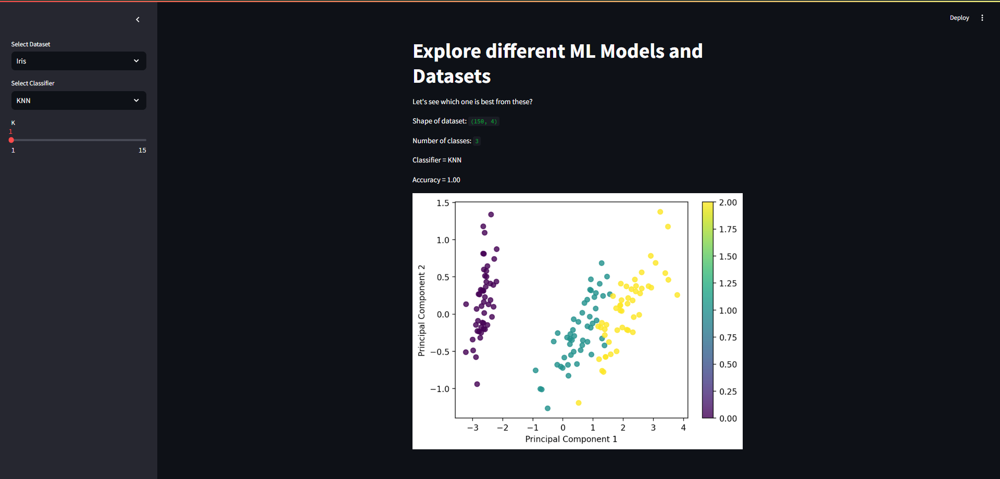

# My Streamlit App – Explore ML Models on Popular Datasets

Welcome to my interactive **Machine Learning Model Explorer** built using **Streamlit**. This app allows users to:

- Select different datasets
- Choose between popular ML models (SVM, KNN, Random Forest)
- Tune hyperparameters through the sidebar
- Visualize results in 2D using PCA
- View model accuracy scores instantly

---

## Features

### Select from popular datasets:
- Iris 
- Breast Cancer
- Wine 

### Choose and tune classifiers:
- **K-Nearest Neighbors (KNN)** – Adjust the number of neighbors  
- **Support Vector Machine (SVM)** – Control the regularization parameter `C`  
- **Random Forest** – Set `n_estimators` and `max_depth`

### Real-time insights:
- Shows dataset shape and number of classes
- Displays accuracy of the selected model
- Visualizes data in 2D using **PCA** with color-coded target labels

---

## Tech Stack

- **Python**
- **Streamlit**
- **Scikit-learn**
- **Matplotlib**
- **NumPy**

---

## App Preview



---

## How to Run This App Locally

```bash
# 1. Clone the repository
git clone https://github.com/YourUsername/My-Streamlit-App.git

# 2. Navigate into the project directory
cd My-Streamlit-App

# 3. Install the dependencies
pip install -r requirements.txt

# 4. Run the Streamlit app
streamlit run app.py
